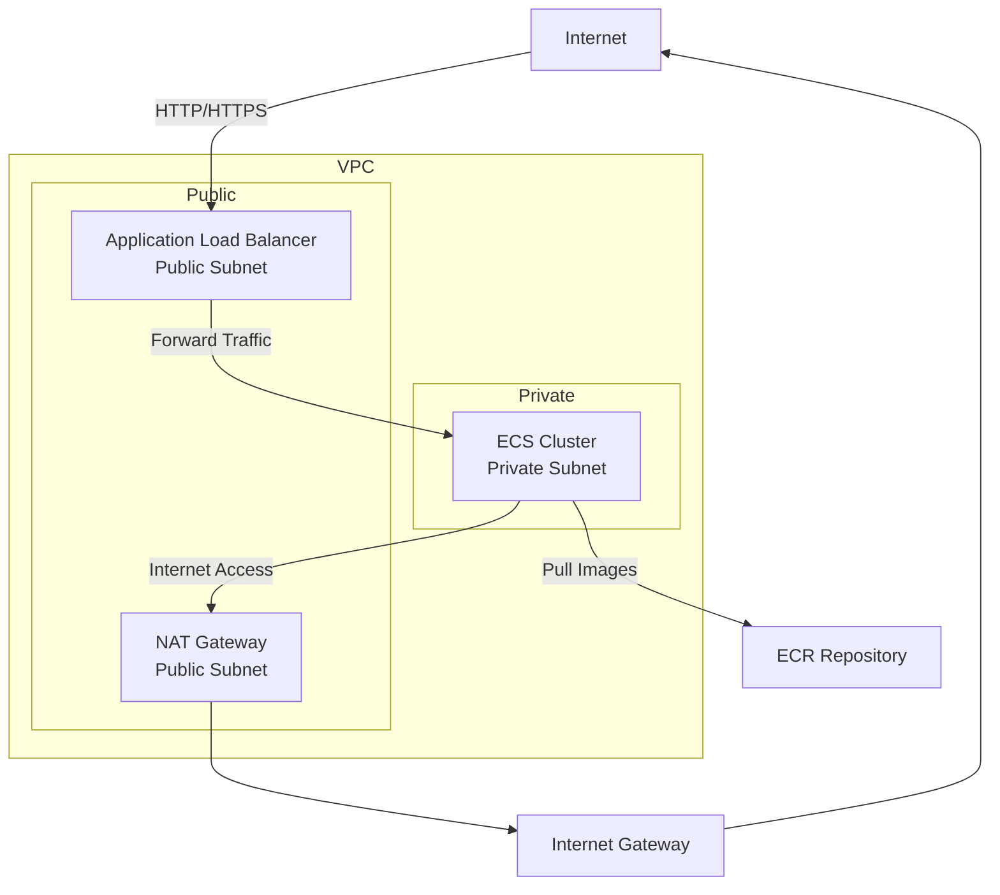
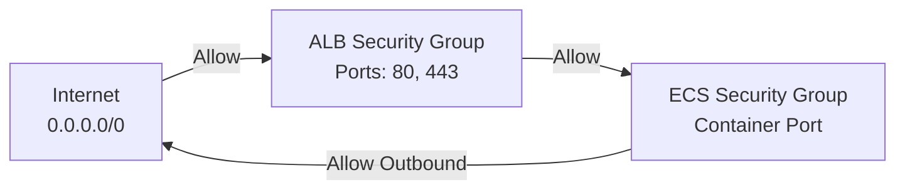
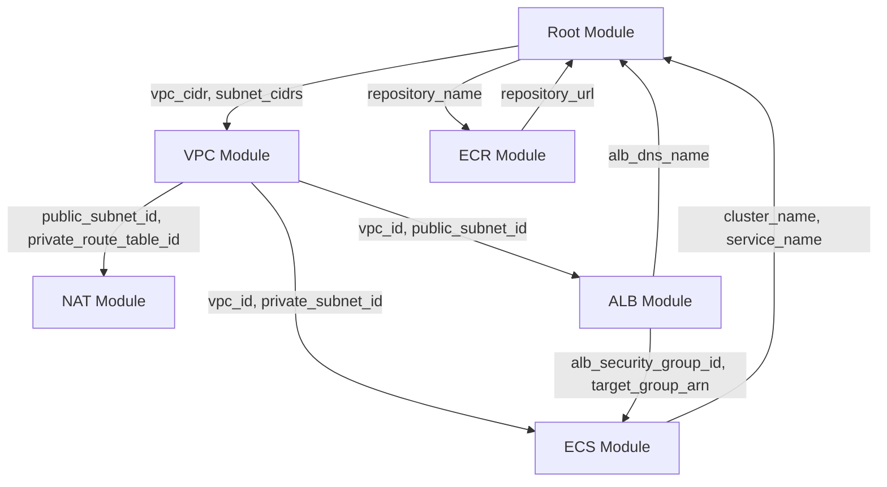

# Design Document: Modular Terraform ECS Infrastructure

## Overview

This design describes a modular, parameterized Terraform infrastructure solution for deploying Docker applications on AWS ECS with proper networking, load balancing, and security. The architecture follows AWS best practices by isolating the ECS cluster in a private subnet while exposing the application through an internet-facing Application Load Balancer in a public subnet.

The infrastructure is organized into five primary Terraform modules:
1. **VPC Module** - Network foundation with public and private subnets
2. **NAT Module** - Network Address Translation for private subnet internet access
3. **ECR Module** - Container registry for Docker images
4. **ALB Module** - Application Load Balancer for traffic distribution
5. **ECS Module** - Container orchestration and task management

A root module orchestrates these components, passing outputs between modules and exposing configuration parameters for flexibility and reusability.

## Architecture

### High-Level Architecture



### Network Architecture

The VPC is configured with:
- **CIDR Block**: Configurable (default: 10.0.0.0/16)
- **Public Subnet**: Single AZ, configurable CIDR (default: 10.0.1.0/24)
- **Private Subnet**: Single AZ, configurable CIDR (default: 10.0.2.0/24)
- **Internet Gateway**: Attached to VPC for public subnet internet access
- **NAT Gateway**: Deployed in public subnet with Elastic IP

### Traffic Flow

1. **Inbound Traffic**: Internet → ALB (public subnet) → ECS Tasks (private subnet)
2. **Outbound Traffic**: ECS Tasks (private subnet) → NAT Gateway (public subnet) → Internet Gateway → Internet
3. **Image Pull**: ECS Tasks → ECR (via NAT Gateway)

### Security Architecture



## Components and Interfaces

### 1. VPC Module

**Purpose**: Creates the network foundation with public and private subnets, route tables, and internet gateway.

**Inputs**:
```hcl
variable "vpc_cidr" {
  description = "CIDR block for VPC"
  type        = string
  default     = "10.0.0.0/16"
}

variable "public_subnet_cidr" {
  description = "CIDR block for public subnet"
  type        = string
  default     = "10.0.1.0/24"
}

variable "private_subnet_cidr" {
  description = "CIDR block for private subnet"
  type        = string
  default     = "10.0.2.0/24"
}

variable "availability_zone" {
  description = "Availability zone for subnets"
  type        = string
}

variable "project_name" {
  description = "Project name for resource tagging"
  type        = string
}
```

**Outputs**:
```hcl
output "vpc_id" {
  description = "ID of the VPC"
  value       = aws_vpc.main.id
}

output "public_subnet_id" {
  description = "ID of the public subnet"
  value       = aws_subnet.public.id
}

output "private_subnet_id" {
  description = "ID of the private subnet"
  value       = aws_subnet.private.id
}

output "internet_gateway_id" {
  description = "ID of the internet gateway"
  value       = aws_internet_gateway.main.id
}

output "public_route_table_id" {
  description = "ID of the public route table"
  value       = aws_route_table.public.id
}

output "private_route_table_id" {
  description = "ID of the private route table"
  value       = aws_route_table.private.id
}
```

**Resources Created**:
- `aws_vpc.main` - VPC with DNS support enabled
- `aws_subnet.public` - Public subnet with auto-assign public IP
- `aws_subnet.private` - Private subnet
- `aws_internet_gateway.main` - Internet gateway attached to VPC
- `aws_route_table.public` - Route table with route to internet gateway
- `aws_route_table.private` - Route table (NAT gateway route added by NAT module)
- `aws_route_table_association.public` - Associates public subnet with public route table
- `aws_route_table_association.private` - Associates private subnet with private route table

### 2. NAT Module

**Purpose**: Provides internet access for resources in the private subnet through Network Address Translation.

**Inputs**:
```hcl
variable "public_subnet_id" {
  description = "ID of the public subnet for NAT Gateway"
  type        = string
}

variable "private_route_table_id" {
  description = "ID of the private route table"
  type        = string
}

variable "project_name" {
  description = "Project name for resource tagging"
  type        = string
}
```

**Outputs**:
```hcl
output "nat_gateway_id" {
  description = "ID of the NAT Gateway"
  value       = aws_nat_gateway.main.id
}

output "elastic_ip" {
  description = "Elastic IP address of the NAT Gateway"
  value       = aws_eip.nat.public_ip
}
```

**Resources Created**:
- `aws_eip.nat` - Elastic IP for NAT Gateway
- `aws_nat_gateway.main` - NAT Gateway in public subnet
- `aws_route.private_nat` - Route in private route table to NAT Gateway (0.0.0.0/0 → NAT)

### 3. ECR Module

**Purpose**: Creates and configures an Elastic Container Registry repository for storing Docker images.

**Inputs**:
```hcl
variable "repository_name" {
  description = "Name of the ECR repository"
  type        = string
}

variable "image_tag_mutability" {
  description = "Image tag mutability setting (MUTABLE or IMMUTABLE)"
  type        = string
  default     = "MUTABLE"
}

variable "scan_on_push" {
  description = "Enable image scanning on push"
  type        = bool
  default     = true
}

variable "lifecycle_policy" {
  description = "Lifecycle policy JSON for image retention"
  type        = string
  default     = null
}
```

**Outputs**:
```hcl
output "repository_url" {
  description = "URL of the ECR repository"
  value       = aws_ecr_repository.main.repository_url
}

output "repository_arn" {
  description = "ARN of the ECR repository"
  value       = aws_ecr_repository.main.arn
}

output "repository_name" {
  description = "Name of the ECR repository"
  value       = aws_ecr_repository.main.name
}
```

**Resources Created**:
- `aws_ecr_repository.main` - ECR repository with scanning configuration
- `aws_ecr_lifecycle_policy.main` (optional) - Lifecycle policy for image retention

**Default Lifecycle Policy** (if none provided):
```json
{
  "rules": [
    {
      "rulePriority": 1,
      "description": "Keep last 10 images",
      "selection": {
        "tagStatus": "any",
        "countType": "imageCountMoreThan",
        "countNumber": 10
      },
      "action": {
        "type": "expire"
      }
    }
  ]
}
```

### 4. ALB Module

**Purpose**: Creates an internet-facing Application Load Balancer with security groups, target groups, and listeners.

**Inputs**:
```hcl
variable "vpc_id" {
  description = "ID of the VPC"
  type        = string
}

variable "public_subnet_id" {
  description = "ID of the public subnet"
  type        = string
}

variable "project_name" {
  description = "Project name for resource tagging"
  type        = string
}

variable "container_port" {
  description = "Port on which the container listens"
  type        = number
  default     = 80
}

variable "health_check_path" {
  description = "Path for ALB health checks"
  type        = string
  default     = "/"
}

variable "health_check_interval" {
  description = "Interval between health checks (seconds)"
  type        = number
  default     = 30
}

variable "health_check_timeout" {
  description = "Health check timeout (seconds)"
  type        = number
  default     = 5
}

variable "healthy_threshold" {
  description = "Number of consecutive successful health checks"
  type        = number
  default     = 2
}

variable "unhealthy_threshold" {
  description = "Number of consecutive failed health checks"
  type        = number
  default     = 2
}

variable "certificate_arn" {
  description = "ARN of SSL certificate for HTTPS listener (optional)"
  type        = string
  default     = null
}
```

**Outputs**:
```hcl
output "alb_dns_name" {
  description = "DNS name of the Application Load Balancer"
  value       = aws_lb.main.dns_name
}

output "alb_arn" {
  description = "ARN of the Application Load Balancer"
  value       = aws_lb.main.arn
}

output "target_group_arn" {
  description = "ARN of the target group"
  value       = aws_lb_target_group.main.arn
}

output "alb_security_group_id" {
  description = "ID of the ALB security group"
  value       = aws_security_group.alb.id
}
```

**Resources Created**:
- `aws_security_group.alb` - Security group for ALB
  - Ingress: Port 80 from 0.0.0.0/0
  - Ingress: Port 443 from 0.0.0.0/0 (if certificate provided)
  - Egress: All traffic to 0.0.0.0/0
- `aws_lb.main` - Application Load Balancer (internet-facing)
- `aws_lb_target_group.main` - Target group for ECS tasks
  - Target type: IP (for awsvpc network mode)
  - Health check configuration
- `aws_lb_listener.http` - HTTP listener on port 80
- `aws_lb_listener.https` (optional) - HTTPS listener on port 443 with SSL certificate

### 5. ECS Module

**Purpose**: Creates ECS cluster, task definitions, services, and associated IAM roles for running containerized applications.

**Inputs**:
```hcl
variable "cluster_name" {
  description = "Name of the ECS cluster"
  type        = string
}

variable "service_name" {
  description = "Name of the ECS service"
  type        = string
}

variable "vpc_id" {
  description = "ID of the VPC"
  type        = string
}

variable "private_subnet_id" {
  description = "ID of the private subnet"
  type        = string
}

variable "alb_security_group_id" {
  description = "ID of the ALB security group"
  type        = string
}

variable "target_group_arn" {
  description = "ARN of the ALB target group"
  type        = string
}

variable "container_image" {
  description = "Docker image to deploy (ECR URL)"
  type        = string
}

variable "container_name" {
  description = "Name of the container"
  type        = string
}

variable "container_port" {
  description = "Port on which the container listens"
  type        = number
  default     = 80
}

variable "task_cpu" {
  description = "CPU units for the task (256, 512, 1024, 2048, 4096)"
  type        = string
  default     = "256"
}

variable "task_memory" {
  description = "Memory for the task in MB (512, 1024, 2048, etc.)"
  type        = string
  default     = "512"
}

variable "desired_count" {
  description = "Desired number of tasks"
  type        = number
  default     = 1
}

variable "log_retention_days" {
  description = "CloudWatch log retention in days"
  type        = number
  default     = 7
}

variable "additional_task_policy_arns" {
  description = "Additional IAM policy ARNs to attach to task role"
  type        = list(string)
  default     = []
}

variable "environment_variables" {
  description = "Environment variables for the container as key-value pairs"
  type        = map(string)
  default     = {}
}

variable "secrets" {
  description = "Sensitive environment variables from AWS Secrets Manager or SSM Parameter Store (ARN format)"
  type = list(object({
    name      = string
    valueFrom = string
  }))
  default = []
}
```

**Outputs**:
```hcl
output "cluster_id" {
  description = "ID of the ECS cluster"
  value       = aws_ecs_cluster.main.id
}

output "cluster_name" {
  description = "Name of the ECS cluster"
  value       = aws_ecs_cluster.main.name
}

output "service_name" {
  description = "Name of the ECS service"
  value       = aws_ecs_service.main.name
}

output "task_definition_arn" {
  description = "ARN of the task definition"
  value       = aws_ecs_task_definition.main.arn
}

output "task_execution_role_arn" {
  description = "ARN of the task execution role"
  value       = aws_iam_role.task_execution.arn
}

output "task_role_arn" {
  description = "ARN of the task role"
  value       = aws_iam_role.task.arn
}
```

**Resources Created**:
- `aws_ecs_cluster.main` - ECS cluster with container insights enabled
- `aws_cloudwatch_log_group.main` - CloudWatch log group for container logs
- `aws_security_group.ecs_tasks` - Security group for ECS tasks
  - Ingress: Container port from ALB security group
  - Egress: All traffic to 0.0.0.0/0 (for NAT Gateway access)
- `aws_iam_role.task_execution` - IAM role for ECS task execution
  - Managed policy: AmazonECSTaskExecutionRolePolicy
  - Inline policy: ECR pull permissions, CloudWatch logs permissions
- `aws_iam_role.task` - IAM role for ECS tasks (application permissions)
  - Additional policies attached based on input
- `aws_ecs_task_definition.main` - Task definition with:
  - Fargate launch type
  - awsvpc network mode
  - Container definition with image, port mappings, environment variables
  - awslogs log driver configuration
- `aws_ecs_service.main` - ECS service with:
  - Fargate launch type
  - Desired count configuration
  - Load balancer integration with target group
  - Network configuration in private subnet
  - Health check grace period

**Task Definition Structure**:
```json
{
  "family": "service_name",
  "networkMode": "awsvpc",
  "requiresCompatibilities": ["FARGATE"],
  "cpu": "256",
  "memory": "512",
  "executionRoleArn": "task_execution_role_arn",
  "taskRoleArn": "task_role_arn",
  "containerDefinitions": [
    {
      "name": "container_name",
      "image": "container_image",
      "portMappings": [
        {
          "containerPort": 80,
          "protocol": "tcp"
        }
      ],
      "environment": [
        {
          "name": "ENV_VAR_NAME",
          "value": "env_var_value"
        }
      ],
      "secrets": [
        {
          "name": "SECRET_NAME",
          "valueFrom": "arn:aws:secretsmanager:region:account:secret:secret-name"
        }
      ],
      "logConfiguration": {
        "logDriver": "awslogs",
        "options": {
          "awslogs-group": "/ecs/service_name",
          "awslogs-region": "region",
          "awslogs-stream-prefix": "ecs"
        }
      }
    }
  ]
}
```

**Environment Variable Configuration**:

The ECS module supports two types of environment variables:

1. **Plain Environment Variables** (`environment_variables` parameter):
   - Passed as a map of key-value pairs
   - Stored in plain text in the task definition
   - Suitable for non-sensitive configuration (e.g., `LOG_LEVEL=info`, `REGION=us-east-1`)
   - Example:
     ```hcl
     environment_variables = {
       LOG_LEVEL = "info"
       APP_ENV   = "production"
       REGION    = "us-east-1"
     }
     ```

2. **Secrets** (`secrets` parameter):
   - References to AWS Secrets Manager or SSM Parameter Store
   - Values are not stored in task definition, only ARN references
   - Suitable for sensitive data (e.g., database passwords, API keys)
   - Requires additional IAM permissions for task execution role
   - Example:
     ```hcl
     secrets = [
       {
         name      = "DATABASE_PASSWORD"
         valueFrom = "arn:aws:secretsmanager:us-east-1:123456789:secret:db-password-abc123"
       },
       {
         name      = "API_KEY"
         valueFrom = "arn:aws:ssm:us-east-1:123456789:parameter/api-key"
       }
     ]
     ```

**When to Provide Environment Variables**:
- Environment variables are provided when invoking the ECS module in the root module
- They are defined in the root module's `terraform.tfvars` or passed via command line
- They become part of the task definition and are available to the container at runtime

### 6. Root Module

**Purpose**: Orchestrates all modules and exposes top-level configuration parameters.

**Inputs**:
```hcl
variable "aws_region" {
  description = "AWS region for deployment"
  type        = string
}

variable "project_name" {
  description = "Project name for resource tagging"
  type        = string
}

variable "availability_zone" {
  description = "Availability zone for subnets"
  type        = string
}

variable "vpc_cidr" {
  description = "CIDR block for VPC"
  type        = string
  default     = "10.0.0.0/16"
}

variable "public_subnet_cidr" {
  description = "CIDR block for public subnet"
  type        = string
  default     = "10.0.1.0/24"
}

variable "private_subnet_cidr" {
  description = "CIDR block for private subnet"
  type        = string
  default     = "10.0.2.0/24"
}

variable "container_image" {
  description = "Docker image to deploy"
  type        = string
}

variable "container_port" {
  description = "Port on which the container listens"
  type        = number
  default     = 80
}

variable "task_cpu" {
  description = "CPU units for the task"
  type        = string
  default     = "256"
}

variable "task_memory" {
  description = "Memory for the task in MB"
  type        = string
  default     = "512"
}

variable "desired_count" {
  description = "Desired number of ECS tasks"
  type        = number
  default     = 1
}

variable "certificate_arn" {
  description = "ARN of SSL certificate for HTTPS (optional)"
  type        = string
  default     = null
}

variable "environment_variables" {
  description = "Environment variables for the container"
  type        = map(string)
  default     = {}
}

variable "secrets" {
  description = "Sensitive environment variables from Secrets Manager or SSM"
  type = list(object({
    name      = string
    valueFrom = string
  }))
  default = []
}
```

**Outputs**:
```hcl
output "alb_dns_name" {
  description = "DNS name of the Application Load Balancer - use this to access your application"
  value       = module.alb.alb_dns_name
}

output "ecr_repository_url" {
  description = "URL of the ECR repository - push your Docker images here"
  value       = module.ecr.repository_url
}

output "ecs_cluster_name" {
  description = "Name of the ECS cluster"
  value       = module.ecs.cluster_name
}

output "ecs_service_name" {
  description = "Name of the ECS service"
  value       = module.ecs.service_name
}

output "vpc_id" {
  description = "ID of the VPC"
  value       = module.vpc.vpc_id
}

output "public_subnet_id" {
  description = "ID of the public subnet"
  value       = module.vpc.public_subnet_id
}

output "private_subnet_id" {
  description = "ID of the private subnet"
  value       = module.vpc.private_subnet_id
}

output "nat_gateway_ip" {
  description = "Elastic IP of the NAT Gateway"
  value       = module.nat.elastic_ip
}
```

**Module Invocations**:
```hcl
module "vpc" {
  source = "./modules/vpc"
  
  vpc_cidr            = var.vpc_cidr
  public_subnet_cidr  = var.public_subnet_cidr
  private_subnet_cidr = var.private_subnet_cidr
  availability_zone   = var.availability_zone
  project_name        = var.project_name
}

module "nat" {
  source = "./modules/nat"
  
  public_subnet_id       = module.vpc.public_subnet_id
  private_route_table_id = module.vpc.private_route_table_id
  project_name           = var.project_name
}

module "ecr" {
  source = "./modules/ecr"
  
  repository_name = "${var.project_name}-app"
}

module "alb" {
  source = "./modules/alb"
  
  vpc_id           = module.vpc.vpc_id
  public_subnet_id = module.vpc.public_subnet_id
  project_name     = var.project_name
  container_port   = var.container_port
  certificate_arn  = var.certificate_arn
}

module "ecs" {
  source = "./modules/ecs"
  
  cluster_name          = "${var.project_name}-cluster"
  service_name          = "${var.project_name}-service"
  vpc_id                = module.vpc.vpc_id
  private_subnet_id     = module.vpc.private_subnet_id
  alb_security_group_id = module.alb.alb_security_group_id
  target_group_arn      = module.alb.target_group_arn
  container_image       = var.container_image
  container_name        = "${var.project_name}-container"
  container_port        = var.container_port
  task_cpu              = var.task_cpu
  task_memory           = var.task_memory
  desired_count         = var.desired_count
  environment_variables = var.environment_variables
  secrets               = var.secrets
}
```

**Example terraform.tfvars**:
```hcl
aws_region      = "us-east-1"
project_name    = "myapp"
availability_zone = "us-east-1a"
container_image = "123456789.dkr.ecr.us-east-1.amazonaws.com/myapp:latest"
container_port  = 8080
desired_count   = 2

# Plain environment variables
environment_variables = {
  LOG_LEVEL = "info"
  APP_ENV   = "production"
  REGION    = "us-east-1"
}

# Sensitive environment variables (from Secrets Manager)
secrets = [
  {
    name      = "DATABASE_PASSWORD"
    valueFrom = "arn:aws:secretsmanager:us-east-1:123456789:secret:db-password-abc123"
  }
]
```

## Data Models

### Terraform Variable Types

**Network Configuration**:
```hcl
type NetworkConfig = {
  vpc_cidr            : string  # CIDR notation (e.g., "10.0.0.0/16")
  public_subnet_cidr  : string  # CIDR notation (e.g., "10.0.1.0/24")
  private_subnet_cidr : string  # CIDR notation (e.g., "10.0.2.0/24")
  availability_zone   : string  # AWS AZ (e.g., "us-east-1a")
}
```

**ECS Configuration**:
```hcl
type ECSConfig = {
  container_image : string       # ECR URL or Docker Hub image
  container_name  : string       # Container identifier
  container_port  : number       # Port number (1-65535)
  task_cpu        : string       # "256", "512", "1024", "2048", "4096"
  task_memory     : string       # Memory in MB, must be compatible with CPU
  desired_count   : number       # Number of tasks (>= 0)
  environment_vars: map(string)  # Key-value pairs for container env vars
}
```

**ALB Configuration**:
```hcl
type ALBConfig = {
  health_check_path     : string  # URL path (e.g., "/health")
  health_check_interval : number  # Seconds (5-300)
  health_check_timeout  : number  # Seconds (2-120)
  healthy_threshold     : number  # Count (2-10)
  unhealthy_threshold   : number  # Count (2-10)
  certificate_arn       : string? # Optional SSL certificate ARN
}
```

### AWS Resource Identifiers

**Resource Naming Convention**:
```
Format: {project_name}-{resource_type}-{environment}
Example: myapp-cluster-prod, myapp-alb-dev
```

**Tagging Strategy**:
```hcl
tags = {
  Project     = var.project_name
  ManagedBy   = "Terraform"
  Module      = "module_name"
  Environment = var.environment  # Optional
}
```

### State Data Structure

Terraform state will track:
- VPC and subnet IDs
- Security group IDs
- IAM role ARNs
- ECS cluster and service ARNs
- ALB and target group ARNs
- ECR repository URL
- NAT Gateway and Elastic IP IDs

## Data Flow

### Deployment Flow

1. **VPC Module Execution**:
   - Creates VPC with specified CIDR
   - Creates public and private subnets
   - Creates Internet Gateway
   - Creates route tables (NAT route added later)
   - Outputs: VPC ID, subnet IDs, route table IDs

2. **NAT Module Execution**:
   - Allocates Elastic IP
   - Creates NAT Gateway in public subnet
   - Adds route to private route table (0.0.0.0/0 → NAT)
   - Outputs: NAT Gateway ID, Elastic IP

3. **ECR Module Execution**:
   - Creates ECR repository
   - Configures image scanning
   - Applies lifecycle policy
   - Outputs: Repository URL, ARN

4. **ALB Module Execution**:
   - Creates ALB security group
   - Creates Application Load Balancer in public subnet
   - Creates target group with health check configuration
   - Creates HTTP listener (and HTTPS if certificate provided)
   - Outputs: ALB DNS name, target group ARN, security group ID

5. **ECS Module Execution**:
   - Creates ECS cluster
   - Creates CloudWatch log group
   - Creates ECS task security group (allows traffic from ALB)
   - Creates IAM roles (execution and task roles)
   - Creates task definition with container configuration
   - Creates ECS service with load balancer integration
   - Outputs: Cluster name, service name, task definition ARN

### Runtime Traffic Flow

**Inbound Request**:
```
User → Internet → ALB (public subnet) → Target Group → ECS Task (private subnet) → Container
```

**Outbound Request** (e.g., API calls, image pulls):
```
Container → ECS Task (private subnet) → NAT Gateway (public subnet) → Internet Gateway → Internet
```

**Image Pull Flow**:
```
ECS Task → NAT Gateway → Internet Gateway → ECR → Returns Image → NAT Gateway → ECS Task
```

**Logging Flow**:
```
Container stdout/stderr → awslogs driver → CloudWatch Logs → Log Group → Log Stream
```

### Parameter Flow Between Modules




## Correctness Properties

*A property is a characteristic or behavior that should hold true across all valid executions of a system—essentially, a formal statement about what the system should do. Properties serve as the bridge between human-readable specifications and machine-verifiable correctness guarantees.*

For this Terraform infrastructure system, correctness properties validate that the infrastructure is created correctly, configured securely, and follows modular design principles. These properties will be tested using Terraform validation, `terraform plan` output analysis, and infrastructure testing tools like Terratest.

### Property 1: VPC Network Foundation Completeness

*For any* valid VPC configuration (CIDR block, subnet CIDRs, availability zone), when the VPC module is applied, the resulting infrastructure should contain exactly one VPC, one public subnet, one private subnet, one Internet Gateway, and two route tables (public and private), all with the specified configuration parameters.

**Validates: Requirements 1.1, 1.2, 1.3, 1.4, 1.7**

### Property 2: Public Subnet Internet Routing

*For any* VPC created by the VPC module, the public subnet's route table should contain a route for 0.0.0.0/0 pointing to the Internet Gateway, enabling direct internet access.

**Validates: Requirements 1.5**

### Property 3: Private Subnet NAT Routing

*For any* VPC with NAT module applied, the private subnet's route table should contain a route for 0.0.0.0/0 pointing to the NAT Gateway, enabling internet access through NAT.

**Validates: Requirements 1.6, 2.3**

### Property 4: NAT Gateway Configuration

*For any* NAT module deployment, the module should create exactly one Elastic IP and one NAT Gateway in the public subnet, with the EIP associated to the NAT Gateway.

**Validates: Requirements 2.1, 2.2**

### Property 5: ECR Repository Configuration

*For any* repository name and configuration parameters (mutability, scan settings, lifecycle policy), the ECR module should create a repository with the specified name and configuration, including image scanning enabled and the provided lifecycle policy (or default if none provided).

**Validates: Requirements 3.1, 3.2, 3.3, 3.4**

### Property 6: ECS Cluster and Service Configuration

*For any* valid ECS configuration (cluster name, service name, task count, CPU, memory), the ECS module should create an ECS cluster with the specified name, a Fargate-based service with the specified desired count, and tasks running in the private subnet.

**Validates: Requirements 4.1, 4.4, 4.6, 4.8**

### Property 7: ECS Task Definition Correctness

*For any* container image, CPU, and memory configuration, the ECS module should create a task definition with Fargate compatibility, awsvpc network mode, the specified container image from ECR, and the specified resource allocations.

**Validates: Requirements 4.2, 4.3, 9.3**

### Property 8: ECS-ALB Integration

*For any* ECS service with ALB target group ARN provided, the service configuration should include the target group in its load balancer configuration, ensuring automatic task registration and deregistration.

**Validates: Requirements 4.5, 9.1, 9.2**

### Property 9: IAM Task Execution Role Permissions

*For any* ECS module deployment, the task execution IAM role should have the AmazonECSTaskExecutionRolePolicy attached and should include permissions for ECR image pulling (ecr:GetAuthorizationToken, ecr:BatchCheckLayerAvailability, ecr:GetDownloadUrlForLayer, ecr:BatchGetImage), CloudWatch Logs writing (logs:CreateLogStream, logs:PutLogEvents), and if secrets are provided, permissions to read from Secrets Manager (secretsmanager:GetSecretValue) or SSM Parameter Store (ssm:GetParameters).

**Validates: Requirements 5.1, 5.2, 5.4, 5.5, 5.7, 10.5**

### Property 10: IAM Task Role Configuration

*For any* ECS module deployment with optional additional policies, the task IAM role should be created and should have all provided additional policy ARNs attached.

**Validates: Requirements 5.3, 5.6**

### Property 11: ALB Public Subnet Placement

*For any* ALB module deployment, the Application Load Balancer should be created in the public subnet with an internet-facing scheme.

**Validates: Requirements 6.1, 6.2**

### Property 12: ALB Security Group Ingress Rules

*For any* ALB module deployment, the ALB security group should allow inbound traffic from 0.0.0.0/0 on port 80, and if a certificate ARN is provided, should also allow inbound traffic on port 443.

**Validates: Requirements 6.3, 6.4, 7.1**

### Property 13: ALB Target Group and Health Checks

*For any* ALB module deployment with health check parameters, the target group should be created with target type "ip" (for awsvpc mode), and should have health check configuration matching the provided parameters (path, interval, timeout, thresholds).

**Validates: Requirements 6.5, 9.5, 9.6**

### Property 14: ALB Listener Configuration

*For any* ALB module deployment, an HTTP listener on port 80 should be created forwarding to the target group, and if a certificate ARN is provided, an HTTPS listener on port 443 should be created with SSL termination.

**Validates: Requirements 6.6, 6.7**

### Property 15: ECS Security Group Isolation

*For any* ECS module deployment with ALB security group ID provided, the ECS tasks security group should allow inbound traffic only from the ALB security group on the container port, and should allow all outbound traffic to 0.0.0.0/0.

**Validates: Requirements 4.7, 7.3, 7.4**

### Property 16: Security Group Traffic Flow

*For any* complete infrastructure deployment, the ALB security group should allow outbound traffic to the ECS security group, and the ECS security group should allow inbound traffic from the ALB security group, creating a valid traffic path.

**Validates: Requirements 7.2**

### Property 17: Custom Security Group Rules Application

*For any* infrastructure deployment with custom security group rules provided as parameters, those rules should be applied to the appropriate security groups in addition to the default rules.

**Validates: Requirements 7.5**

### Property 18: Modular Code Organization

*For any* infrastructure system deployment, the code should be organized into separate module directories (modules/vpc, modules/nat, modules/ecr, modules/alb, modules/ecs), each containing main.tf, variables.tf, and outputs.tf files following Terraform naming conventions.

**Validates: Requirements 8.1, 8.6**

### Property 19: Module Parameterization

*For any* module in the infrastructure system, the module should accept configuration through Terraform variables declared in variables.tf, and should expose data through outputs declared in outputs.tf.

**Validates: Requirements 8.2, 8.5**

### Property 20: Root Module Orchestration

*For any* infrastructure deployment, the root module should invoke all required sub-modules (VPC, NAT, ECR, ALB, ECS) and should expose top-level variables for VPC CIDR, subnet CIDRs, ECS task count, container image, CPU, and memory.

**Validates: Requirements 8.3, 8.4**

### Property 21: Default Parameter Values

*For any* optional parameter in the infrastructure system (VPC CIDR, subnet CIDRs, task CPU, task memory, health check settings, log retention), a sensible default value should be provided in the variable declaration.

**Validates: Requirements 8.7**

### Property 22: ECS Task Network Assignment

*For any* ECS service deployment, tasks should be configured to receive private IP addresses from the private subnet CIDR range.

**Validates: Requirements 9.4**

### Property 23: CloudWatch Logging Configuration

*For any* ECS module deployment, a CloudWatch log group should be created with the configured retention period, and the task definition should configure the awslogs log driver pointing to that log group.

**Validates: Requirements 10.1, 10.2, 10.3, 10.4**

### Property 24: Infrastructure Output Completeness

*For any* complete infrastructure deployment, the root module should output the ALB DNS name, ECR repository URL, ECS cluster name, ECS service name, VPC ID, and subnet IDs, with each output including a descriptive explanation.

**Validates: Requirements 1.8, 2.4, 3.5, 6.8, 11.1, 11.2, 11.3, 11.4, 11.5**

### Property 25: Backend Configuration Documentation

*For any* infrastructure system, example backend configuration files and documentation should exist explaining remote state storage (S3), state locking (DynamoDB), and how to switch between local and remote backends.

**Validates: Requirements 12.1, 12.2, 12.3, 12.4**

## Error Handling

### Terraform Validation Errors

**Invalid CIDR Blocks**:
- Validation: Use Terraform `can(cidrhost(var.vpc_cidr, 0))` to validate CIDR format
- Error message: "Invalid CIDR block format. Must be valid IPv4 CIDR notation (e.g., 10.0.0.0/16)"

**Overlapping Subnet CIDRs**:
- Validation: Use Terraform `cidrsubnet()` function to ensure subnets don't overlap
- Error message: "Subnet CIDR blocks must not overlap and must be within VPC CIDR range"

**Invalid CPU/Memory Combinations**:
- Validation: Use Terraform variable validation to ensure valid Fargate CPU/memory pairs
- Valid combinations: https://docs.aws.amazon.com/AmazonECS/latest/developerguide/task-cpu-memory-error.html
- Error message: "Invalid CPU/memory combination for Fargate. See AWS documentation for valid pairs"

**Invalid Availability Zone**:
- Validation: Use data source to validate AZ exists in region
- Error message: "Availability zone {az} does not exist in region {region}"

### AWS API Errors

**Resource Limits**:
- Error: VPC limit exceeded, EIP limit exceeded, etc.
- Handling: Terraform will fail with AWS error message
- Mitigation: Document AWS service limits in README

**IAM Permission Errors**:
- Error: Insufficient permissions to create resources
- Handling: Terraform will fail with AWS error message
- Mitigation: Document required IAM permissions in README

**Resource Dependencies**:
- Error: Attempting to delete resources with dependencies
- Handling: Terraform dependency graph handles creation order
- Mitigation: Use `depends_on` where implicit dependencies aren't detected

### Module Input Validation

Each module should validate inputs using Terraform variable validation blocks:

```hcl
variable "vpc_cidr" {
  type        = string
  description = "CIDR block for VPC"
  
  validation {
    condition     = can(cidrhost(var.vpc_cidr, 0))
    error_message = "VPC CIDR must be a valid IPv4 CIDR block."
  }
}

variable "task_cpu" {
  type        = string
  description = "CPU units for Fargate task"
  
  validation {
    condition     = contains(["256", "512", "1024", "2048", "4096"], var.task_cpu)
    error_message = "Task CPU must be one of: 256, 512, 1024, 2048, 4096."
  }
}

variable "desired_count" {
  type        = number
  description = "Desired number of ECS tasks"
  
  validation {
    condition     = var.desired_count >= 0
    error_message = "Desired count must be a non-negative integer."
  }
}
```

### State Management Errors

**State Lock Conflicts**:
- Error: State is locked by another process
- Handling: Terraform will wait and retry
- Mitigation: Use DynamoDB for state locking with remote backend

**State Drift**:
- Error: Actual infrastructure differs from state
- Handling: Use `terraform refresh` to update state
- Mitigation: Avoid manual changes to infrastructure

## Testing Strategy

### Dual Testing Approach

This infrastructure will be validated using both **unit tests** and **property-based tests** to ensure comprehensive coverage:

- **Unit tests**: Verify specific examples, edge cases, and error conditions using Terratest
- **Property tests**: Verify universal properties across all valid configurations using Terratest with randomized inputs

Both approaches are complementary and necessary for comprehensive infrastructure validation.

### Unit Testing with Terratest

**Framework**: Terratest (Go-based testing framework for Terraform)

**Unit Test Focus**:
- Specific example configurations (e.g., default VPC CIDR, specific task counts)
- Edge cases (e.g., minimum task count of 0, maximum CPU/memory)
- Error conditions (e.g., invalid CIDR blocks, invalid CPU/memory combinations)
- Integration between modules (e.g., VPC outputs used by ECS module)

**Example Unit Tests**:
```go
// Test VPC module with default configuration
func TestVPCModuleDefaults(t *testing.T) {
  // Test that VPC module creates resources with default values
}

// Test ECS module with minimum resources
func TestECSModuleMinimumResources(t *testing.T) {
  // Test ECS with smallest CPU/memory configuration
}

// Test ALB with HTTPS listener
func TestALBWithHTTPS(t *testing.T) {
  // Test ALB module when certificate ARN is provided
}

// Test invalid CIDR block handling
func TestInvalidCIDRBlock(t *testing.T) {
  // Test that invalid CIDR blocks are rejected
}
```

### Property-Based Testing with Terratest

**Configuration**: Minimum 100 iterations per property test (due to randomization)

**Property Test Focus**:
- Universal properties that hold for all valid inputs
- Comprehensive input coverage through randomization
- Infrastructure correctness across different configurations

**Test Tagging**: Each property test must reference its design document property using comments:
```go
// Feature: modular-terraform-ecs-infrastructure, Property 1: VPC Network Foundation Completeness
func TestProperty1_VPCNetworkFoundation(t *testing.T) {
  // Generate random valid VPC configuration
  // Apply VPC module
  // Verify all required resources exist with correct configuration
}
```

**Property Test Implementation Pattern**:
```go
// Feature: modular-terraform-ecs-infrastructure, Property 5: ECR Repository Configuration
func TestProperty5_ECRRepositoryConfiguration(t *testing.T) {
  t.Parallel()
  
  for i := 0; i < 100; i++ {
    t.Run(fmt.Sprintf("Iteration_%d", i), func(t *testing.T) {
      // Generate random repository name
      repoName := generateRandomRepoName()
      mutability := randomChoice([]string{"MUTABLE", "IMMUTABLE"})
      scanOnPush := randomBool()
      
      terraformOptions := &terraform.Options{
        TerraformDir: "../modules/ecr",
        Vars: map[string]interface{}{
          "repository_name":      repoName,
          "image_tag_mutability": mutability,
          "scan_on_push":         scanOnPush,
        },
      }
      
      defer terraform.Destroy(t, terraformOptions)
      terraform.InitAndApply(t, terraformOptions)
      
      // Verify repository exists with correct configuration
      repositoryURL := terraform.Output(t, terraformOptions, "repository_url")
      assert.Contains(t, repositoryURL, repoName)
      
      // Verify configuration using AWS SDK
      // ... additional assertions
    })
  }
}
```

**Randomization Helpers**:
```go
func generateRandomCIDR() string {
  // Generate random valid CIDR block
}

func generateRandomRepoName() string {
  // Generate random valid ECR repository name
}

func randomChoice(options []string) string {
  // Return random element from slice
}

func randomBool() bool {
  // Return random boolean
}

func generateRandomCPUMemory() (string, string) {
  // Return random valid Fargate CPU/memory pair
}
```

### Testing Layers

**1. Module-Level Tests**:
- Test each module in isolation
- Verify module outputs are correct
- Test with various input combinations

**2. Integration Tests**:
- Test root module with all sub-modules
- Verify data flows correctly between modules
- Test complete infrastructure deployment

**3. Validation Tests**:
- Test Terraform validation rules
- Verify invalid inputs are rejected
- Test error messages are clear

**4. Infrastructure Verification**:
- Verify AWS resources are created correctly
- Test network connectivity (ALB → ECS)
- Verify security group rules are applied
- Test IAM permissions are correct

### Test Execution

**Local Testing**:
```bash
cd test
go test -v -timeout 30m
```

**CI/CD Integration**:
- Run tests on pull requests
- Use temporary AWS account for testing
- Clean up resources after tests
- Parallel test execution where possible

**Test Isolation**:
- Each test uses unique resource names
- Tests can run in parallel
- Automatic cleanup with `defer terraform.Destroy()`

### Property Test Coverage

Each correctness property (1-25) will have a corresponding property-based test:
- Property 1-3: VPC and routing tests
- Property 4: NAT Gateway tests
- Property 5: ECR repository tests
- Property 6-8: ECS cluster and service tests
- Property 9-10: IAM role tests
- Property 11-14: ALB tests
- Property 15-17: Security group tests
- Property 18-21: Module structure tests
- Property 22: Network assignment tests
- Property 23: CloudWatch logging tests
- Property 24: Output tests
- Property 25: Documentation tests

### Test Data Management

**Cleanup Strategy**:
- All tests use `defer terraform.Destroy()` for automatic cleanup
- Tests tag resources with unique identifiers
- Orphaned resources can be identified and cleaned up

**Test Fixtures**:
- Sample Terraform configurations for testing
- Mock AWS responses for unit tests
- Example backend configurations

### Performance Considerations

**Test Duration**:
- Property tests with 100 iterations may take 30-60 minutes
- Use parallel execution to reduce total time
- Consider running full property tests only in CI/CD

**Cost Management**:
- Use smallest resource sizes for testing
- Clean up resources immediately after tests
- Consider using LocalStack for some tests (where applicable)
